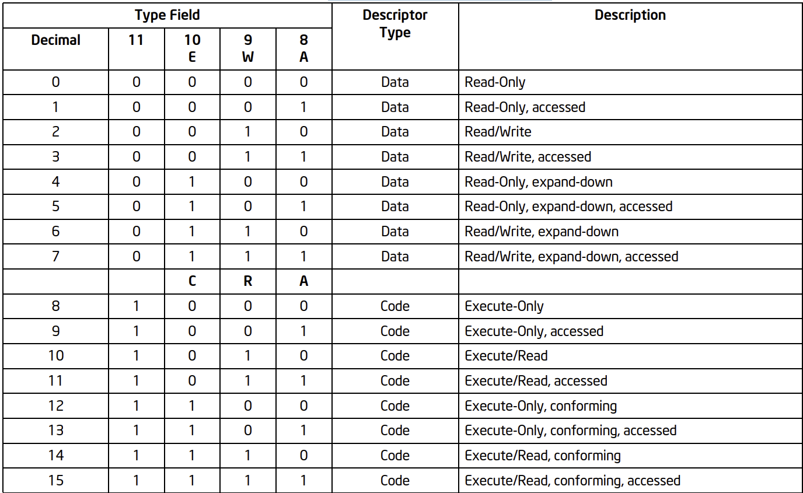
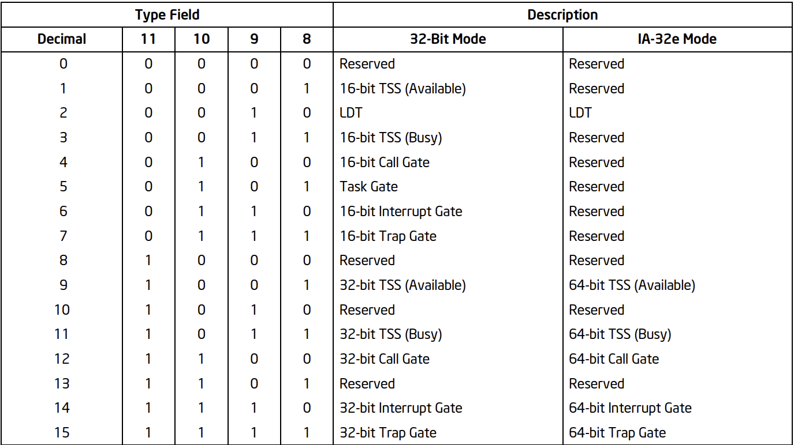

## CPUID instruction
A way to check availability of features in our CPU.

Instead of operands it uses EAX and sometimes ECX as input.

Output goes to ax, bx, cx, dx, and the CPU support this operation if ID flag (bit 21) is on.

-----

## Execution modes

#### Real-address mode
The oldest and simplest. No virtual memory and no rings, runs in 16 bit.

#### Protected mode
Main mode that OS run in today. 

#### IA-32e mode
Also referred as long/extended mode.

#### System management mode
If SMI (system management interrupt) received, we are getting to this mode.

Can protect itself from all other privileged code.

Currently does not seem relevant/interesting 

##### Diagram that shows relevant parts in execution modes

----

## Privilige Rings

* Note that most OSs only have 2 rings (instead of 4 showen in the picture). Ring 0-2 serves as ring 0 (kernel mode) and ring 3 as ring 1 (user mode)

## Segmentation
A concept that is being used in order to divide the process memory space into a few logical segments. 

These are the commonly used segments:

Code segment  - includes the program instructions

Data segment  - global and static variables 

Stack segment - function call stack

Extra segment - extra (usually data)

Each segment have a segment descriptor, that would include base address, size and access.

With segments, logical addresses came by. They are shaped in the form of `SEGMENT+offset`.

##### Logical address with 64-bit Operand Size
<table>
  <tr>
    <th>16-bit Segment Selector Bits 79–64</th>
    <th>64-bit Offset Bits 63–0</th>
  </tr>
</table>

##### Logical address with 32-bit Operand Size
<table>
  <tr>
    <th>16-bit Segment Selector Bits 47–32</th>
    <th>32-bit Offset Bits 31–0</th>
  </tr>
</table>

##### Linear address with 32-bit Operand Size
<table>
  <tr>
    <th>32-bit Offset Bits 31–0</th>
  </tr>
</table>

More in-depth, in order to transform logical address to linear, the `segment selecotor` needs to find in a descriptor table its base address and from there to add the `offset`.

That descriptor table is also known as the **GDT** (Global Descriptor Table)

If we will take a deeper dive into the segment selector, 
we will se it is built in the following form:
<table>
  <tr>
    <th>Index Bits 3-15</th>
    <th>GDT/LDT Bit 2</th>
    <th>RPL Bits 0-1</th>
  </tr>
</table>

 Index - the row umber in the table

 GDT(=0)/LDT(=1) -  from which table it should look for, local or global

 RPL - Requested Privilege Level, value corresponds to the ring.

 0 = kernel mode, 3 = user mode. Then, the CPU executes max(RPL, CPL) (CPL - Current Privilege Level) to determine what access to give.

## GDT && LDT

GDTR (GDT Register) - Base address of GDT in RAM and its size

LDTR (LDT Register) - Base address of LDT in RAM and its size

Each entry in the tables is called **segment descriptor**. 

The segment descriptor takes **8 bytes** has the following structure:

<table> <tr> <th colspan="8">Base 31:24 31–24</th> <th>G 23</th> <th>D/B 22</th> <th>L 21</th> <th>AVL 20</th> <th colspan="4">Seg. Limit 19:16 19–16</th> <th>P 15</th> <th colspan="2">DPL 14–13</th> <th>S 12</th> <th colspan="4">Type 11–8</th> <th colspan="2">Base 23:16 7–0</th> </tr> <tr> <th colspan="16">Base Address 15:00 31–16</th> <th colspan="16">Segment Limit 15:00 15–0</th> </tr> </table>

**L** -  64-bit code segment, long mode flag

**Base Address** - 32 bits address that points to the start of the segment, in 64 bits is always 0.

**Segment limit** - size if the segment in bytes, in 64 bit mode, limits are not checked.

**G** - granularity flag, irrelevant for 64 bit mode, wether the limit is in bytes or 4096 bytes.

**P** - present flag (1=present), if not present, the cpu generates segment-not-present exception

**S** - system flag, 0 for system segment, 1 for code/data segment

**TYPE** - type flags, differs if the segment is system or code/data:
 

Expand down - allow stack growth towards lower addresses

conforming - allow lower privilege code to execute them (meaning ring 3 e.g. could execute ring 0 conformed segment)

#### And for system:

**D/B** - If the seg. descriptor has a type of code, then it will be called Default Opcode Size, if 0 its 16 bits, 1 for 32 bits.
if it has a type of data, then it it will be called  big flag, if 0 moves SP by 16 bits, and 1 for 32 bits.

**DPL** - Descriptor Privilege Level Flag from 0-3

**AVL** - Available flag, no specific usage